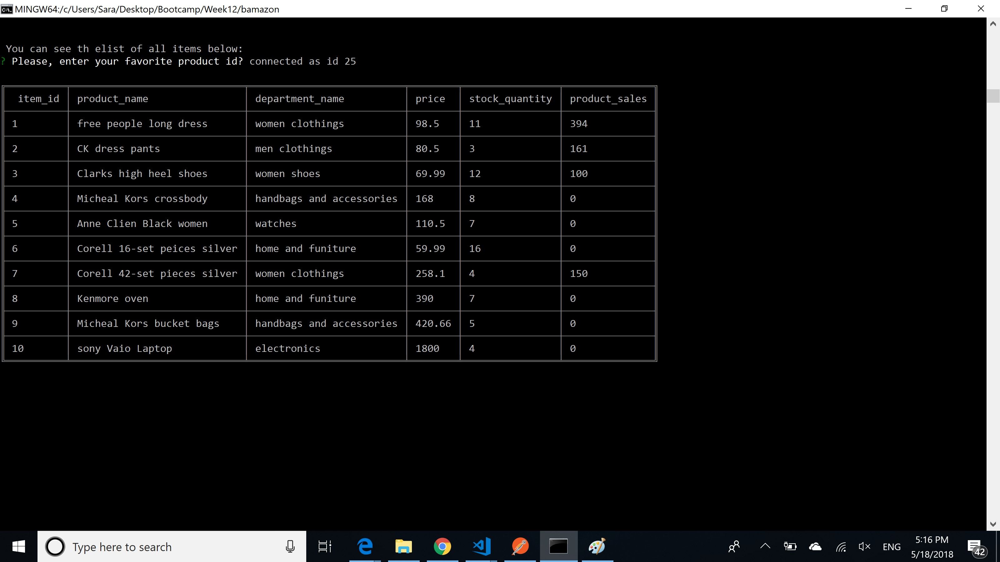

#Bamazon

## Requirement
- Creatie an Amazon-like storefront with the MySQL skills.
- The app will take in orders from customers and deplete stock from the store's inventory. 
- Track product sales across store's departments.
- provide a summary of the highest-grossing departments in the store.


## Instructions
* In this activity, I created an online store called Bamazon. This store has the inventory database. All product information is stored on MYSQL database. 

### Prerequisites
- Download Chrome or Internet Explorer or Mozilla for your specific operating system.
- Check if you have Node installed by typing  'node -v' in your terminal. If it returns anything related to version then you have it installed.
- You need MySQL on your system. Also, if you are Mac user you need to install SquelPro. If you are Windows User, you would need MySQL Workbench.

### bamazonCustomer.js
- This page shows list of products to the customers and ask them to insert the id of the product that they want to buy.
- In order to see the results, you need to type the command below in your command line after you change your current directory to the same local directory that you 
pulled the git hub repository :
	bamazonCustomer.js
- After running bamazonCustomer.js, it calls the showItems() function which included from connection.js. You can see the screen of showing the product list to the customer:

 !

- Then it asks you about the id of the product and the quantity that you want to buy. After user enters the id and quantity, it calls selectByID() function included from connection.js. selectByID(), get the product id and retrieve data like quantity, price, and product_sales from product table. 
	> If the requested quantity is less or equal than what we have in stock, it issues the bill and update the quantity by subtraction of previous quantity by requested quantity. Also, according to the quantity and price it issues the bill and updates the product_sales amount. You can see the bill as output below:
	
    > If requested quantity is greater than the number of products that we have, then it shows a message of "insufficient inventory". You can see this scenario in the screens below:


### bamazonManager.js
- Application asks user each time if she wants to see the menu. After she enters "Y", then shows the menu. If user select <View Products for Sale>, then it shows the list of all products. 

- If user select <View Low Inventory>, then it shows all products that are the counts is less than 5.

- If user selects <Add to Inventory>, then it asks about the id of product and the count that she wants to add. And, updates the table with new quantity+old quantity.

- If user selects <Add New Product>, then it asks all questions of name, quantity, department, and price.

- If user selects <View Products for Sale>, then she can see all products including whatever she added new inventory and also existed inventory.


### bamazonSupervisor.js

- Application shows you the menu with three different options: 
	>  <View Product Sales by Department>
	>  <Create New Department>
	>  <Finish>
	
- If user clicks <View Product Sales by Department>, then it shows the table with the department id, name, overhead costs, product sales, total profit. It adds the product sales of all products with the same department name and shows it under product_sales. It is sum of all product sales within same department. Then it subtract over_hea_costs value of product_sales column of each department to show how much profit that each department has.

- If user selects  <Create New Department>, then it asks about the name and overhead costs of department to inser the data to department table. you can see the screenshot of table befor adding departments:


Then user should insert the data about new department.

You can see the screenshot of department table after adding new department with name: dep1 and costs:3000 in the following image:

- If user selects <Finish>, then it ends the connection.

## Technologies Used
- Node.js
- Inquirer NPM Package
- cli-table NPM Package
- MySQL

## Code Explanation
### Lesson Learned
- How to save save, update, delete, and read data from database.
- How to use database like MySQL in Node.js 

### Code Highlights
```
function productSalesByDepartments(){
    var query="SELECT d.department_id as department_id,d.department_name as department_name,d.over_head_costs as over_head_costs,"
    + "sum(p.product_sales) as product_sales,(sum(p.product_sales)-d.over_head_costs) as total_profit "+
    "FROM departments AS d INNER JOIN products AS p"+
    " WHERE d.department_name=p.department_name group by department_name";
    console.log(query);
    connection.query(query,function(err,res){
      
       var table = new Table({
        chars: { 'top': '═' , 'top-mid': '╤' , 'top-left': '╔' , 'top-right': '╗'
               , 'bottom': '═' , 'bottom-mid': '╧' , 'bottom-left': '╚' , 'bottom-right': '╝'
               , 'left': '║' , 'left-mid': '╟' , 'mid': '─' , 'mid-mid': '┼'
               , 'right': '║' , 'right-mid': '╢' , 'middle': '│' }
        });
      table.push(["department_id", "department_name","over_head_costs","product_sales","total_profit"]);
        for(var i=0;i<res.length;i++){
          
            var department_id=res[i].department_id;
            var department_name=res[i].department_name;
            var over_head_costs=res[i].over_head_costs;
            var product_sales;
            var total_profit;
        if(res[i].product_sales){
             product_sales = res[i].product_sales;
        }
        else{
            product_sales ="";
        }
        if(res[i].total_profit){
            total_profit=res[i].total_profit;
        }
        else{
            total_profit ="";
        }
    

    table.push([department_id, department_name,over_head_costs,product_sales,total_profit]);
      }
   console.log("\n");
   console.log(table.toString());
   for(i=0;i<res.length;i++){
        console.log("\n");
   }

       
    });
}
function newDepartment(departmentName,overHeadCosts){
   
    
    connection.query(
        "INSERT INTO departments SET ?",
        {
            
          department_name: departmentName,
          over_head_costs: overHeadCosts
         
        },
        function(err, res) {
         
        }
      );
}
function selectDepartments(){
    connection.query("SELECT * FROM departments", function(err, res) {
        if (err) throw err;
        var table = new Table({
            chars: { 'top': '═' , 'top-mid': '╤' , 'top-left': '╔' , 'top-right': '╗'
                   , 'bottom': '═' , 'bottom-mid': '╧' , 'bottom-left': '╚' , 'bottom-right': '╝'
                   , 'left': '║' , 'left-mid': '╟' , 'mid': '─' , 'mid-mid': '┼'
                   , 'right': '║' , 'right-mid': '╢' , 'middle': '│' }
            });
          table.push([" department_id", "department_name","over_head_costs"]);
    
        for(var i=0;i<res.length;i++){
            var sales=0;
           
            table.push([res[i].department_id.toString(), res[i].department_name.toString(),res[i].over_head_costs.toString()]);
           
        }    
        
   console.log("\n\n");
    console.log(table.toString());
       
  }); 
}
```
## Authors
- Sara Alinazari

